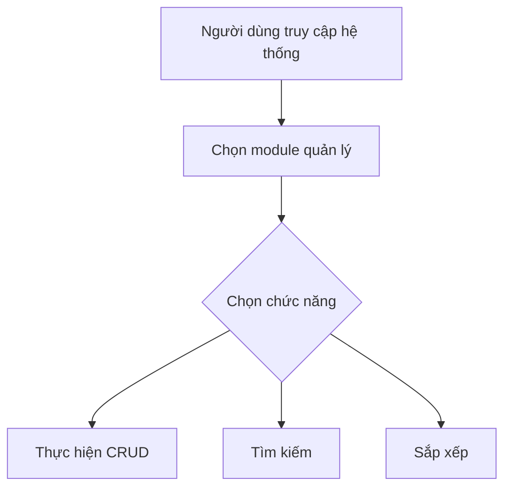

# MusicManager

# Hệ Thống Quản Lý Bài Hát, Nghệ Sĩ

## Được Phát Triển Bởi:
Đặng Thanh Tùng
## Mô Tả Ứng Dụng
Hệ thống quản lý nhạc là một ứng dụng web giúp quản lý người dùng, nghệ sĩ, bài hát, thể loại, danh sách phát một cách hiệu quả. Ứng dụng cung cấp các chức năng CRUD, tìm kiếm, sắp xếp cho các đối tượng.

## Mục Đích
- Quản lý thông tin người dùng, nghệ sĩ
- Quản lý thông tin bài hát
- Quản lý thông tin thể loại, danh sách phát
- Cung cấp giao diện người dùng dễ sử dụng
- Hiển thị dữ liệu hiệu quả thông qua DataTables

## Công Nghệ
Dự án sử dụng các công nghệ sau:
- **Laravel Framework** (cập nhật lên phiên bản mới nhất)
- **PHP 8.x**
- **MySQL - PhpAdmin**
- **DataTables với jQuery**
- **AdminLTE 3.x** (giao diện admin)
- **HTML, CSS, JavaScript**
- **Laravel Repository Pattern**
- **Laravel Service Pattern**
- **Laravel Events & Listeners**


### Sơ Đồ Chức Năng (Sơ Đồ Thuật Toán)


## Chu Trình Phát Triển
### Các Giai Đoạn:
1. **Analysis**: Phân tích yêu cầu và thiết kế database
2. **Design**: Áp dụng các design patterns (Repository, Service)
3. **Implementation**: Viết code theo các patterns đã thiết kế
4. **Testing**: Unit tests, Feature tests
5. **Deployment**: CI/CD pipeline

## Deployment
### Cài đặt môi trường
```sh
composer create-project laravel/laravel music-management
cd music-management
```

### Tạo database
```sql
CREATE DATABASE defaultdb;
```

### Cấu hình `.env`
```env
DB_CONNECTION=sqlite
DB_HOST=127.0.0.1
DB_PORT=3306
DB_DATABASE=C:/xampp/htdocs/Music/Musicweb-main/database/database.sqlite
DB_USERNAME=root
DB_PASSWORD=
```

### Cài đặt dependencies
```sh
composer require jeroennoten/laravel-adminlte
composer require laravel/ui
```

### Chạy migrations
```sh
php artisan key:generate
php artisan migrate
php artisan db:seed
```

### Deploy lên server
```sh
php artisan serve
```

## Lưu ý về cải tiến cấu trúc
- **Áp dụng Repository Pattern** giúp tách biệt logic truy cập dữ liệu từ controllers.
- **Service Layer** chứa business logic, giúp code dễ test và bảo trì.
- **Request Validation** giúp tách biệt logic validation.
- **API Resources** chuẩn hóa dữ liệu trả về.
- **Events & Listeners** xử lý các tác vụ phụ không đồng bộ.

>>>>>>> b1b2036 (commit)
