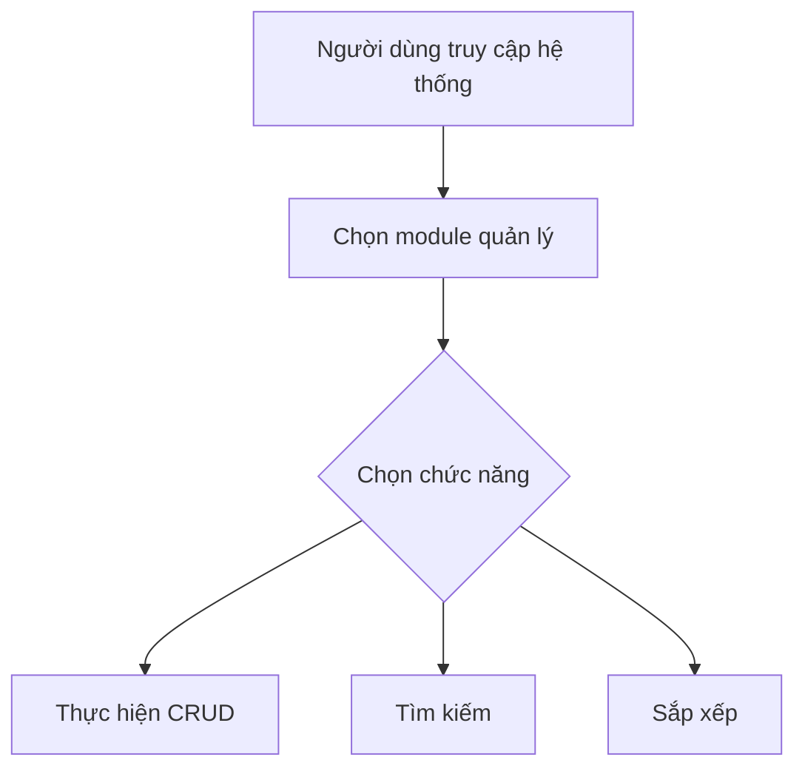
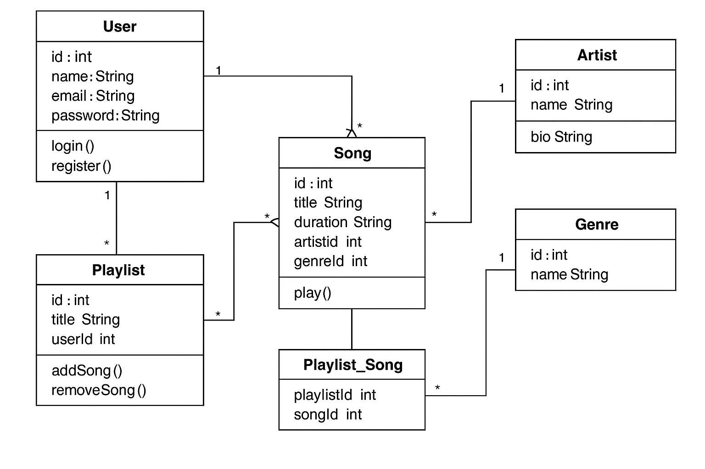

# MusicManager

# Hệ Thống Quản Lý Bài Hát, Nghệ Sĩ

## Được Phát Triển Bởi:
Đặng Thanh Tùng

## link repo

https://github.com/thanh-tung-25/Music

## Mô Tả Ứng Dụng
Hệ thống quản lý nhạc là một ứng dụng web giúp quản lý người dùng, nghệ sĩ, bài hát, thể loại, danh sách phát một cách hiệu quả. Ứng dụng cung cấp các chức năng CRUD, tìm kiếm, sắp xếp cho các đối tượng.

## Mục Đích
- Quản lý thông tin người dùng, nghệ sĩ
- Quản lý thông tin bài hát
- Quản lý thông tin thể loại, danh sách phát
- Cung cấp giao diện người dùng dễ sử dụng
- Hiển thị dữ liệu hiệu quả thông qua DataTables

## Công Nghệ
Dự án sử dụng các công nghệ sau:
- **Laravel Framework** (cập nhật lên phiên bản mới nhất)
- **PHP 8.x**
- **MySQL - PhpAdmin**
- **DataTables với jQuery**
- **AdminLTE 3.x** (giao diện admin)
- **HTML, CSS, JavaScript**
- **Laravel Repository Pattern**
- **Laravel Service Pattern**
- **Laravel Events & Listeners**


### Sơ Đồ Chức Năng (Sơ Đồ Thuật Toán)

## Biểu đồ database Class diagram



## Chu Trình Phát Triển
### Các Giai Đoạn:
1. **Analysis**: Phân tích yêu cầu và thiết kế database
2. **Design**: Áp dụng các design patterns (Repository, Service)
3. **Implementation**: Viết code theo các patterns đã thiết kế
4. **Testing**: Unit tests, Feature tests
5. **Deployment**: CI/CD pipeline

## Deployment
### Cài đặt môi trường
```sh
composer create-project laravel/laravel music-management
cd music-management
```

### Tạo database
```sql
CREATE DATABASE defaultdb;
```

### Cấu hình `.env`
```env
DB_CONNECTION=sqlite
DB_HOST=127.0.0.1
DB_PORT=3306
DB_DATABASE=C:/xampp/htdocs/Music/Musicweb-main/database/database.sqlite
DB_USERNAME=root
DB_PASSWORD=
```

### Cài đặt dependencies
```sh
composer require jeroennoten/laravel-adminlte
composer require laravel/ui
```

### Chạy migrations
```sh
php artisan key:generate
php artisan migrate
php artisan db:seed
```

### Deploy lên server
```sh
php artisan serve
```

## Lưu ý về cải tiến cấu trúc
- **Áp dụng Repository Pattern** giúp tách biệt logic truy cập dữ liệu từ controllers.
- **Service Layer** chứa business logic, giúp code dễ test và bảo trì.
- **Request Validation** giúp tách biệt logic validation.
- **API Resources** chuẩn hóa dữ liệu trả về.
- **Events & Listeners** xử lý các tác vụ phụ không đồng bộ.

# PHẦN II: NỘI DUNG
## 1.Yêu cầu
### 1.1. Yêu Cầu Chính
•	Xây dựng ứng dụng web bằng Laravel Framework.
•	Nội dung quản lý: hệ thống nghe nhạc (quản lý người dùng, nghệ sĩ, bài hát, thể loại, danh sách phát).
•	Thực hiện đầy đủ chức năng CRUD (Create, Read, Update, Delete) cho các đối tượng trong hệ thống.
### 1.2. Cải Thiện Giao Diện
•	Sử dụng Grid có Filter và sắp xếp để tối ưu hiển thị dữ liệu.
•	Áp dụng các thư viện JavaScript sẵn có như Bootstrap, DataTables để cải thiện giao diện.
•	Thiết kế giao diện theo hướng chuyên nghiệp, trực quan và thân thiện với người dùng.
## 2. Quy trình hoạt động và giao diện hệ thống
### 2.1 Quy trình đăng nhập
• Thời gian: Thực hiện khi đăng nhập tài khoản
 
Giao diện đăng nhập
• Vai trò: Bảo mật thông tin
• Quy trình:
-	Người quản lí đăng nhập đúng tài khoản, mật khẩu, và có role = ‘admin’ (vd: tài khoản: admin@example.com, mật khẩu: password ) sẽ mở giao diện quản lí, ngoài ra nếu role = ‘artist’ thì sẽ có quyền upload bài hát, nếu role = ‘user’ sẽ điều hướng về giao diện trang web nghe nhạc ( chưa phát triển )
 
Giao diện quản lý( dashboard )
*Bên cạnh đó trang web còn cho phép:
- Đăng ký tài khoản:
 
Sau khi nhập các thông tin hợp lệ hệ thống sẽ lưu trữ tài khoản người dùng lại trên cơ sở dữ liệu (có thể quản lý thông qua tài khoản admin)
- Quên mật khẩu:
 
Điền thông tin email đã dùng để đăng ký tài khoản để nhận mã và đặt lại mật khẩu.
### 2.2 Quy trình thêm thông tin
• Thời gian: Thực hiện khi muốn thêm đối tượng mới( người dùng, bài hát, thể loại, danh sách phát, nghệ sĩ)
• Vai trò: Thêm đối tượng mới và cập nhật dữ liệu lên bảng khi thực hiện thành công.
• Quy trình:
-	Khi bấm nút thêm sẽ chuyển đến trang create( mỗi model là 1 trang create riêng)
-	Người quản lí nhập thông tin vào các mục có sẵn
-	Chọn “Lưu” để lưu lại thông tin vừa nhập, chọn “Hủy” nếu không muốn thêm nữa
-	Ngoài ra chương trình sẽ kiểm tra thông tin được nhập vào nếu không đúng định dạng sẽ báo lỗi
 
 
         Giao diện thêm người dùng( các model khác sẽ có các trường thông tin khác)
Sau khi nhập các trường thông tin hợp lệ và bấm lưu sẽ được điều hướng về lại trang quản lý với thông báo thành công
 
### 2.3 Quy trình sửa thông tin
• Thời gian: Thực hiện khi muốn cập nhật thông tin đối tượng( người dùng, bài hát, thể loại, danh sách phát, nghệ sĩ)
• Vai trò: Cập nhật, chỉnh sửa dữ liệu lên bảng khi thực hiện thành công.
• Quy trình:
-	Khi bấm nút sửa sẽ chuyển đến trang edit( mỗi model là 1 trang edit riêng)
-	Người quản lí thực hiện chỉnh sửa thông tin
-	Chọn “Lưu” để lưu lại thông tin vừa nhập, chọn “Hủy” nếu không muốn chỉnh sửa nữa
-	Ngoài ra chương trình sẽ kiểm tra thông tin được nhập vào nếu không đúng định dạng sẽ báo lỗi
 
### 2.4 Quy trình xóa đối tượng
• Vai trò: Xóa đối tượng đã có trong danh sách
• Quy trình:
-	Chọn đối tượng cần xóa
-	Chọn “Xóa”, ấn “Ok” để xóa, “Hủy” để hủy
 
 
### 2.5 Quy trình tìm kiếm đối tượng
• Vai trò: Tìm kiếm đối tượng đã có trong danh sách dựa trên từ khóa hoặc các trường thông tin
• Quy trình:
-	Nhập từ khóa tìm kiếm (hoặc không), chọn các bộ lọc nếu cần thiết và thực hiện tìm kiếm
-	Thông tin đối tượng khớp với từ khóa và bộ lọc sẽ được hiển thị

### 2.6 Update bài hát 
   B1. Thêm nghệ sĩ vào Quản lý nghệ sĩ
   B2. Thêm thể loại vào Quản lý thể loại
   B3. Thêm bài hát vào Quản lý bài hát 
 	-Thêm tên bài hát
 	-Thêm thể loại
 	-Thời lượng của bài hát 
 	-Thêm five URL bài hát
 
### 2.7 Giao diện người dùng sau khi được update bài hát mới 

  	Sau khi update bài hát mới giao diện người dùng sẽ tự động được cập nhật thông tin của bài hát mới và hiển thị lên giao diện người dùng
 
Và đây là chi tiết của bài hát khi ở giao diện người dùng:

 
### 2.8 Giao dien


## 2.9. Link video demo
https://drive.google.com/file/d/1pyaSX6rnSr_AZkPpzfAf9LSDMSOx1cRz/view?usp=sharing

# PHẦN III: SƠ ĐỒ THỰC HIỆN
## 1.Sơ đồ chức năng
Yêu cầu chức năng:
 Quản lý người dùng: Đăng ký, đăng nhập, phân quyền, cập nhật thông tin, quản lý tài khoản.
Quản lý bài hát: Thêm, sửa, xóa, xem danh sách, tìm kiếm theo tên, nghệ sĩ, thể loại.
Quản lý nghệ sĩ: Thêm, sửa, xóa, xem danh sách, liên kết bài hát.
Quản lý thể loại: Thêm, sửa, xóa, xem danh sách, liên kết bài hát.
Quản lý danh sách phát: Tạo, sửa, xóa, thêm/xóa bài hát, xem danh sách phát cá nhân/công khai. 
Yêu Cầu Phi Chức Năng:
Dễ sử dụng: Giao diện trực quan, thiết kế hiện đại nhờ AdminLTE 3.x. 
Hiệu suất cao: Sử dụng DataTables để xử lý và hiển thị dữ liệu lớn một cách mượt mà. 
Bảo mật: Áp dụng các biện pháp xác thực và phân quyền tiêu chuẩn từ Laravel.

## 2.Sơ đồ quan hệ thực thể

Thực thể	Thuộc tính	Mô tả
USER (Người dùng)	id (int, PK) 
name (string) 
email (string) 
password (string) 
avatar (string) 
role (string)	Lưu trữ thông tin người dùng, bao gồm đăng nhập, vai trò, và hình đại diện.
PLAYLIST (Danh sách phát)	id (int, PK) 
user_id (int, FK) 
title (string)	Người dùng có thể tạo nhiều danh sách phát.
SONG (Bài hát)	id (int, PK) 
title (string) 
artist_id (int, FK) 
genre_id (int, FK) 
file_url (string) 
duration (int)	Chứa thông tin bài hát, liên kết với nghệ sĩ và thể loại.
PLAYLIST_SONG (Bảng trung gian)	playlist_id (int, FK) 
song_id (int, FK)	Liên kết bài hát với danh sách phát.
ARTIST (Nghệ sĩ)	id (int, PK) 
name (string) 
bio (text) 
avatar (string)	Quản lý thông tin nghệ sĩ, mỗi nghệ sĩ có nhiều bài hát.
GENRE (Thể loại)	id (int, PK) 
name (string) 
description (text)	Quản lý thể loại nhạc, mỗi thể loại có nhiều bài hát.

Ghi chú:
•	PK (Primary Key): Khóa chính của bảng.
•	FK (Foreign Key): Khóa ngoại liên kết với bảng khác.

# PHẦN IV: KIỂM THỬ VÀ ĐÁNH GIÁ
## 1.Kiểm thử
Các chức năng hoạt động ổn định
## 2.Đánh giá
Giao diện người dùng đơn giản dể sử dụng, tìm kiếm nhanh chóng, chính xác tiết kiệm thời gian giúp hạn chế được việc phải lưu quá nhiều sổ sách trong quản lý. Tuy nhiên một số chức năng cần phải nâng cấp và tối ưu để đạt được kết qua thực thi tốt nhất cho các dự án công nghệ thông tin tiếp theo.

# KẾT LUẬN
Dự án hệ thống quản lý nhạc cung cấp các chức năng quan trọng như quản lý người dùng, bài hát, nghệ sĩ, thể loại và danh sách phát. Hệ thống cho phép người dùng đăng ký, đăng nhập, tạo danh sách phát và tìm kiếm bài hát một cách dễ dàng. Cấu trúc cơ sở dữ liệu được thiết kế chặt chẽ với các mối quan hệ hợp lý giữa các thực thể, đảm bảo tính mở rộng và hiệu suất cao. Dự án này là nền tảng vững chắc để phát triển thêm các tính năng nâng cao như gợi ý bài hát, tương tác người dùng và phát nhạc trực tuyến.
Em xin trân thành cảm ơn!

# TÀI LIỆU THAM KHẢO
1.	Tài liệu của gv: Nguyễn Lệ Thu
2.	Tài liệu chat GPT
3.	W3 School

